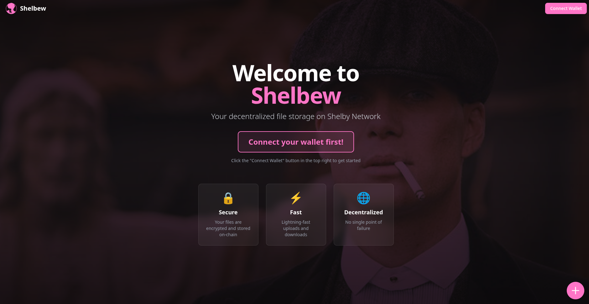
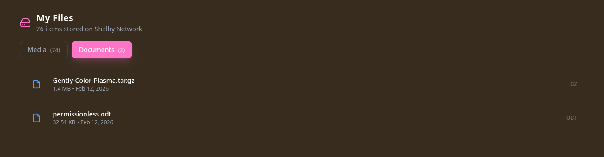

# Shelbew 🚀

Your decentralized file storage on the Shelby Network – fast, secure, and super easy to use!

## What's This About? 🤔

Shelbew is a web app that lets you upload and manage your files on the Shelby blockchain. Think of it as your personal cloud storage, but decentralized! No single point of failure, everything's on-chain, and you're in full control of your data.

## Screenshots 📸

### Landing Page



The landing page welcomes you with three core promises: **Secure** (your files are encrypted and stored on-chain), **Fast** (lightning-fast uploads and downloads), and **Decentralized** (no single point of failure). Just connect your wallet to get started!

### File Gallery View


Browse all your uploaded files in a beautiful gallery view. Filter between Media and Documents tabs to find what you need quickly. Currently showing 76 items stored on the Shelby Network!

### Document Manager



Manage your documents with ease. View file details, download files directly, or organize them however you like. Everything's just a click away!

## Features ✨

- **Multi-Wallet Support** – Connect with Petra, OKX, or Nightly wallets
- **Drag & Drop Uploads** – Upload files effortlessly with our intuitive interface
- **On-Chain Storage** – All files are stored securely on the Shelby blockchain
- **File Management** – Browse, filter, and manage your files with ease
- **Direct Downloads** – Download your files anytime, anywhere
- **Toast Notifications** – Get instant feedback with transaction hashes and explorer links
- **Responsive Design** – Works beautifully on desktop and mobile

## Getting Started 🏁

1. **Clone the repo**

   ```bash
   git clone https://github.com/stlkrdumb/shelbew.git
   cd shelbew
   ```

2. **Install dependencies**

   ```bash
   npm install
   ```

3. **Run the development server**

   ```bash
   npm run dev
   ```

4. **Open your browser** and navigate to `http://localhost:3000`

5. **Connect your wallet** and start uploading!

## Tech Stack 💻

- **Next.js** – React framework for production
- **TypeScript** – Type safety and better DX
- **Shelby SDK** – Blockchain integration
- **Tailwind CSS** – Utility-first styling
- **Shadcn/UI** – Beautiful, accessible components
- **React Toastify** – Sleek notifications

## How It Works 🔧

1. Connect your wallet (Petra, OKX, or Nightly)
2. Upload your files through the web interface
3. Files are encrypted and stored on the Shelby blockchain
4. Access and download your files anytime
5. View transaction details on the [Shelby Explorer](https://explorer.shelby.xyz)

## Contributing 🤝

Contributions are welcome! Feel free to open issues or submit pull requests. Let's make Shelbew even better together!

## License 📄

MIT License – feel free to use this however you'd like!

---

Built with ❤️ for the Shelby Network community
